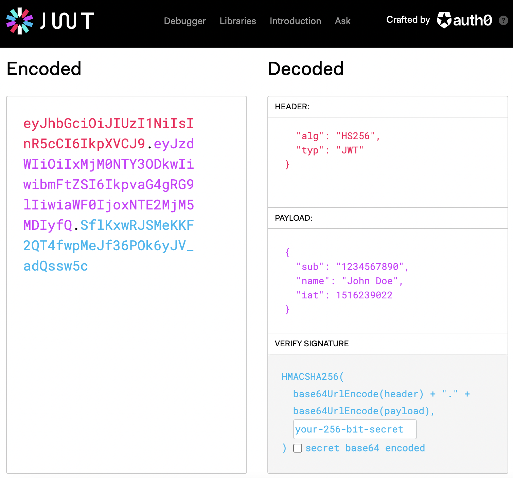

こんにちは🐠  
先日JWTを使う機会がありましたので、ここにまとめておきます。  
***
### JWTとは何か
JSON Web Token (JWT)とは、情報をJSONオブジェクトとして安全に送受信できるトークンの仕様のことです。[RFC 7519](https://datatracker.ietf.org/doc/html/rfc7519)として標準化されています。  

### JWTのいいところ
JWTを使うと、以下のようなメリットがあります。
- 通信の相手を**認証**した上で情報を受け渡せる。  
（通信の相手が誰で、情報を渡しても良い権限を持っているかを確認）
- 受け渡した情報が、正しい発信者から正しい受信者に向けて送られたものであることが確認できる。
-  受け渡した情報が、改ざんされていないことを確認することができる。

### JWTの構造
jwtは、`ヘッダー`.`ペイロード`.`署名`の3つの要素から構成されます。  
>- ヘッダー  
署名の暗号化に使用したアルゴリズムと、トークンのタイプが記されている。ヘッダー自体はBase64urlでエンコードされている。  
 (例 ※エンコード前)  
  `{"alg": "HS256","typ": "JWT"}`  
 (例 ※エンコード後)  
  `eyJhbGciOiJIUzI1NiIsInR5cCI6IkpXVCJ9`  

>- ペイロード  
受け渡す情報をここに格納する。例えば、ユーザーの持つIDや、権限の有効期限・発行元などの、認証するために必要な情報を格納。Registered claimsと呼ばれる項目を含めることが推奨されている。これには、"iss"(Issuer/発行元)や"iat"(Issued At/発行時間)、"exp"(Expiration Time/有効期限)などがある。
[詳細はこちら](https://datatracker.ietf.org/doc/html/rfc7519#section-4.1)  
ペイロード自体はBase64urlでエンコードされている。  
(例 ※エンコード前)  
`{"sub": "1234567890","name": "John Doe","iat": 1516239022}`  
(例 ※エンコード後)  
`eyJzdWIiOiIxMjM0NTY3ODkwIiwibmFtZSI6IkpvaG4gRG9lIiwiaWF0IjoxNTE2MjM5MDIyfQ`

>- 署名  
署名は、「エンコードされたヘッダー」と、「エンコードされたペイロード」と、指定した「シークレット」をもとに、ヘッダーで指定したアルゴリズムを使って作成されます。  
 (例) `c5jf1lMwbhnCncTmgX5BvO3v4PPEPst9i1smEH1S6Rc`  
署名を使って、JWTが改ざんされていないことを確認できます。  
(筆者メモ：具体的にどのような方法で確認するのか調べきれていないので、今後追記したい。)

### JWTを生成してみる
[jwt.io](https://jwt.io/)というサイトには、JWTのデバッガーがあります。  
右側のヘッダーやペイロードの内容を変えると、左側のJWTも変化することが確認できます。  

### 今後まとめたいこと
今回はJWTとはどんなものかについてまとめました。  
具体的な使い方やセッションとの違いについてまとめられなかったので、今後別の記事でまとめたいと思います。

### 参考リンク
>- [jwt.io](https://jwt.io/)
>- [RFC 7519](https://datatracker.ietf.org/doc/html/rfc7519)  
>※以下、今後の記事で参考にしたいリンク
>- [そもそもJWTに関する私の理解は完全に間違っていた！ -  koduki.hatenablog.com](https://koduki.hatenablog.com/entry/2019/11/03/163014)  
>- [JWT authentication: Best practices and when to use it  -  blog.logrocket.com](https://blog.logrocket.com/jwt-authentication-best-practices/)