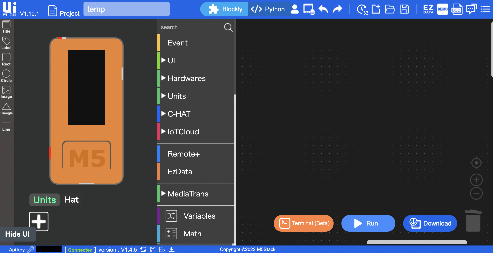
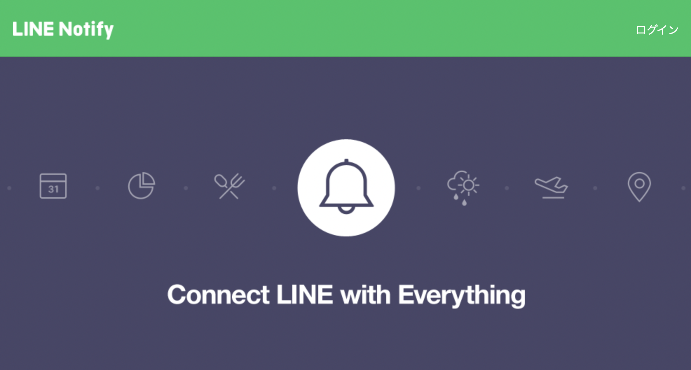
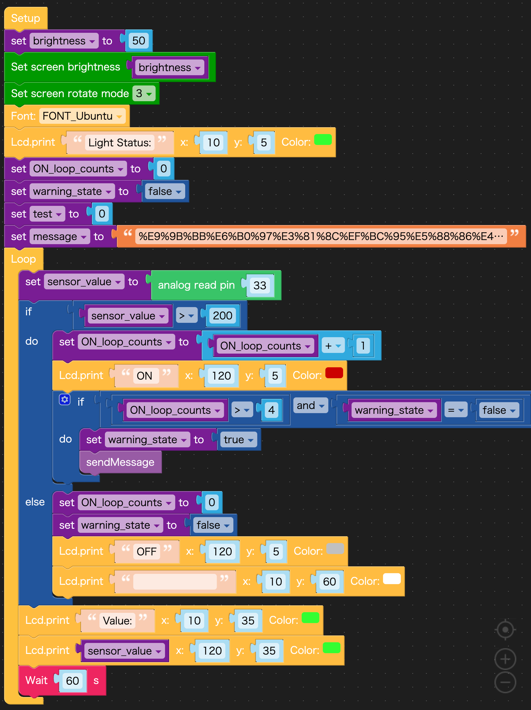
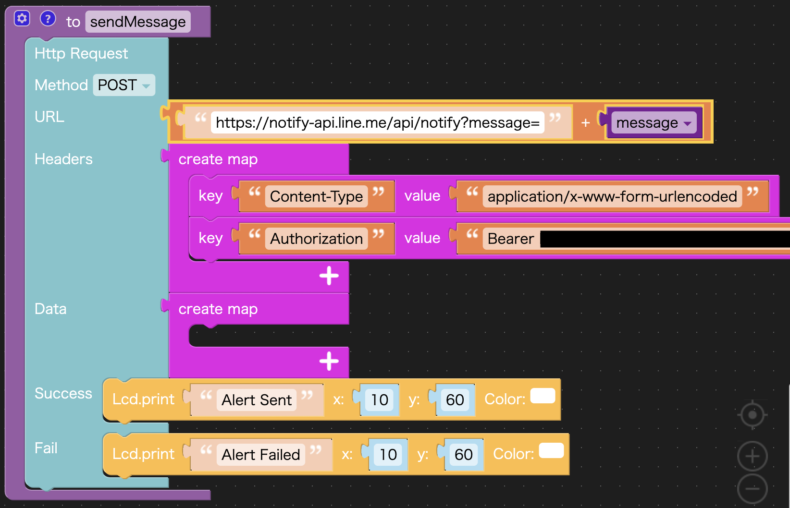
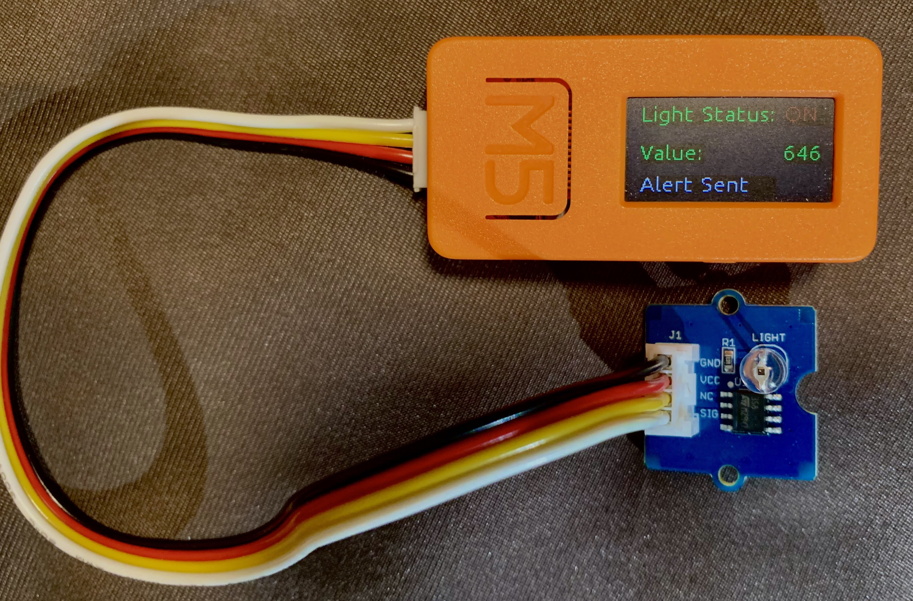
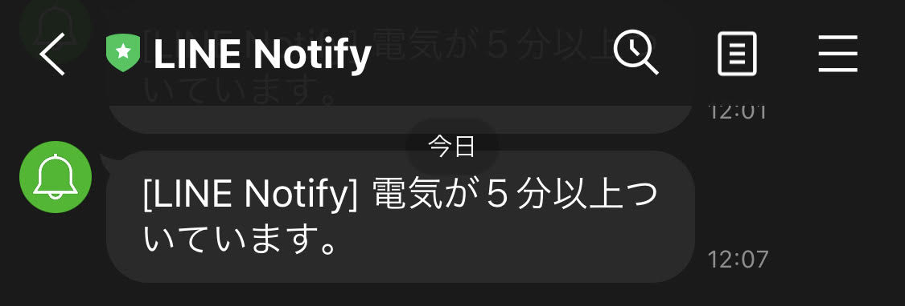

こんばんは〜🌃  
夜寝る前に布団に入った直後、  
「あ、電気消したっけ…」  
ってなることありませんか？！  

玄関、洗面所、トイレとか…  
あれ？つけっぱなしかも…と気になって寝れないので仕方なく起き上がって確認しに行く。  
これが地味に面倒なんですよね〜。  
（こういうのを思い出すのってなんで布団に入った後なんでしょう。。せめて立ち上がってる時に思い出せれば辛くないのに…😮‍💨）  

そこで、電気つけっぱなしを教えてくれるIoTデバイスを作ってみることにしました。💡  
***
### 用意したもの
- [M5StickC](https://www.switch-science.com/catalog/5517/)
- [GROVE 光センサ](https://www.switch-science.com/catalog/3284/)

### 作成内容
- 光センサーでデバイスを設置した部屋の明かりがONかOFFか認識する。
- ONの状態が５分以上続いていた場合、LINE Notifyで電気付けっぱなしである旨メッセージを送る。  

### 実装手順
#### M5StickCのセットアップ
まずM5StickCの[セットアップ](https://docs.m5stack.com/en/quick_start/m5stickc/uiflow)を行います。  
これでUIFlowという開発環境とデバイス本体を接続することができます。
  

#### LINE Notifyの設定
次に、[LINE Notify](https://notify-bot.line.me/ja/)の設定を行います。 
 
LINE Notifyは、Webサービスと連携して通知を送ることができるサービスです。   
例えば、GitHubと連携してプルリクエストの通知を送ったり、サーバー監視サービスのMackerelと連携してサーバーのアラートを通知したりすることができます。  
LINEのログインをしてからマイページより、「アクセストークンの発行(開発者向け)」を行います。  
トークン名は"LINE Notify"とし、通知の送信先は自分宛にしたかったので「1:1でLINE Notifyから通知を受け取る」を選択しました。  
発行したトークンはあとで使うのでコピーしておきます。  

[LINE Notify API Document](https://notify-bot.line.me/doc/ja/)に、通知を送るためのHTTPリクエスト方法が記載されています。  
今回は以下のようにHTTPリクエストを送ります。
> ヘッダー
| リクエストメソッド/ヘッダ  |  値  |
| :---: | :---: | 
|  Method  |  POST  | 
|  Content-Type  | application/x-www-form-urlencoded  | 
|  Authorization  |  	Bearer <access_token>  | 

> ボディ
| リクエストパラメータ  |  値  |
| :---: | :---: | 
|　message | 通知するメッセージ(urlエンコードしたもの) | 

#### プログラムを書く
UIFlowに戻り、プログラムを書いていきます。  
UIFlowでは、Blocklyというブロックを組み立ててプログラムを書くツールがあり、簡単に作成することができました。 
- メインのプログラム  
1分ごとにsensor_valueが200より大きい(ライトがONである)かどうかを確認します。大きければON_loop_countsを1増やしていき、ON_loop_countsが５以上になったら(ライトONの状態が5分以上続いたら)sendMessageファンクションが動きます。
 
- sendMessage ファンクション  
POSTメソッドで"https://notify-api.line.me/api/notify"へリクエストを送ります。
 

### 結果
- ライトONの状態が5分以上続いた、デバイスの表示は以下の通りです。ちょっと見えづらいのですが、一行目は"Light Status: ON"と書いてあります。 
- 通知は以下のように届きました！ 

### 問題点と反省
窓のない個室なら問題ないのですが、日中に自然光が入ってしまう場所だとライトがONであると認識してしまいます。  
また、通知が来ても結局自分で消しに行かないといけないので、消し忘れ防止にはなりますが作業の削減にはなりません😰  
より良い解決法として、赤外線センサーを使って人を感知した時だけ電気をつけるようにしたほうがいいですね。。  
今回は光センサーしか手元になかったのですが、また他のセンサーを使って小さなIoTデバイスの開発に挑戦してみたいです。

***
### 参考リンク
>- [UIFlow](https://m5stack.github.io/UIFlow_doc/ja/)
>- [【M5StickC】ブロックプログラミング（UIFlow）で動作させるための環境づくり＆セットアップ手順！](https://burariweb.info/electronic-work/m5stickc-uiflow-setting.html)
>- [M5Stackで計測した温度データをLINEに送信してみた](https://craft-gogo.com/m5stack-line/#toc6)