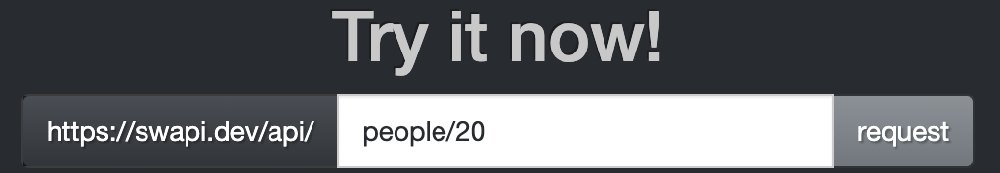
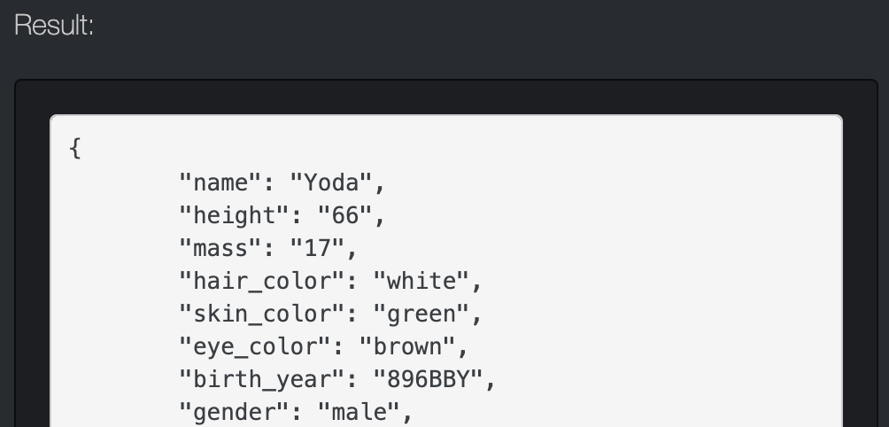
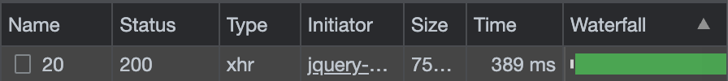
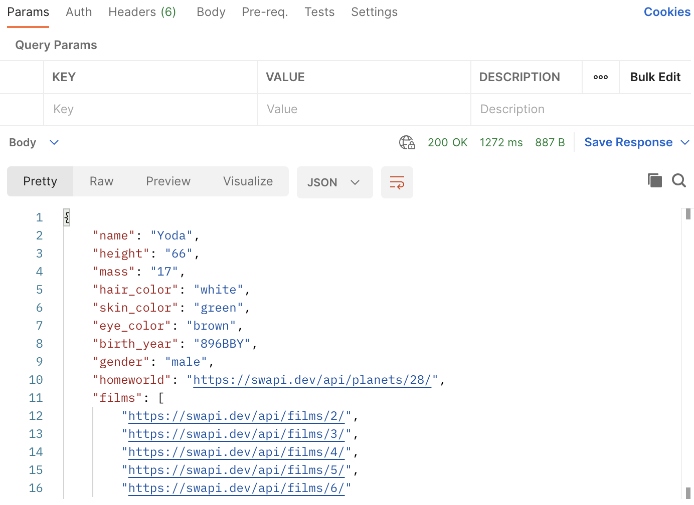

こんにちは🌷
前回の続きで、Web APIについてもうちょっと書きたいと思います。


***
### APIを叩いてみよう①　

実際にAPIにGETリクエストを送って、レスポンスを受けるところを体験してみましょう。  
今回使ってみるAPIは、こちらです。
> [SWAPI - The Star Wars API](https://swapi.dev/)  

スターウォーズの登場人物や惑星、宇宙船の名前などのデータを持っているAPIで、GETリクエストを送ることでデータを参照することができます。オープンソースのため学習用に使っている人も多いようです。早速、データをGETしてみましょう。  

Try it now!の下で、`people/20`と入力し、requestボタンを押します。
  

すると、Result欄にJSON形式で結果が表示されました！これで、APIを叩いてデータをGETすることができました。
  

ここで、デベロッパーツールのNetworkタブを見てみましょう。ここではブラウザはChromeを使っています。  
 

Statusが200で返ってきているので、問題なく通信できたことがわかりますね。

***
### APIを叩いてみよう②　〜curlコマンドを使う〜

curlコマンドとは、URLで示される場所との間でデータを送受信するためのコマンドです。メソッドを指定して使う方法は以下の通りです。
> `curl -X [リクエストメソッド] "URL"`   
※`[リクエストメソッッド]`には、POST, GET, PUT, DELETEを入力可。  

Terminalを開いて、①と同じ例を入力してみます。
```
curl -X GET "https://swapi.dev/api/people/20"
```
すると、①と同じようにJSON形式の結果が返ってきます。
```
{"name":"Yoda","height":"66","mass":"17","hair_color":"white","skin_color":"green","eye_color":"brown","birth_year":"896BBY","gender":"male","homeworld":"https://swapi.dev/api/planets/28/","films":["https://swapi.dev/api/films/2/","https://swapi.dev/api/films/3/","https://swapi.dev/api/films/4/","https://swapi.dev/api/films/5/","https://swapi.dev/api/films/6/"],"species":["https://swapi.dev/api/species/6/"],"vehicles":[],"starships":[],"created":"2014-12-15T12:26:01.042000Z","edited":"2014-12-20T21:17:50.345000Z","url":"https://swapi.dev/api/people/20/"}
```
`curl`の後ろにつけるオプションを付けるともっといろいろなことができるのですが、それについてはまた別の機会にまとめたいと思います。  

***
### APIを叩いてみよう③　〜Postmanを使う〜

Postmanを使うと、リクエスト・レスポンスともに見やすい形で確認できるのでとても便利です。📮
> [Postman  (https://www.postman.com/downloads/)](https://www.postman.com/downloads/)  

ダウンロードして使用、もしくは登録すればブラウザでも使えるみたいですね。

メソッドとURLを指定して、Sendをクリックします。


すると、responseが表示されます。


色もついていて見やすくていい感じです👩‍🚀  
<br />
ちなみに、今回使用したSWAPIではPOST, PUT, DELETEメソッドは有効になっていなかったため、それらのメソッドを使用してリクエストを送ると"405 Method not allowed"となりました。  
<br />

### おわりに
今回は、Web APIに手動でリクエストを送りレスポンスを受け取るところをまとめてみました。APIを活用して何か面白いアプリケーションを作ってみたいなぁと思います🌤